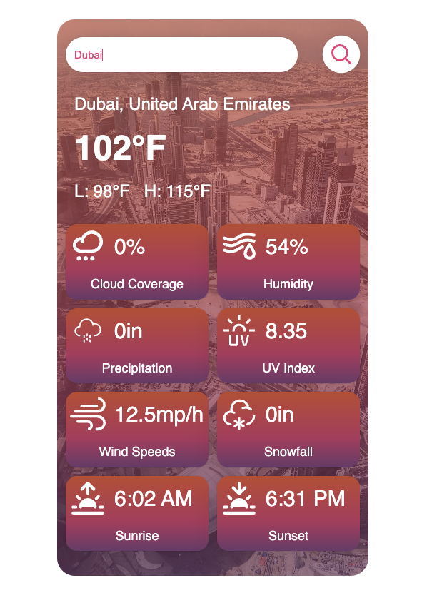

# <a href="https://joshmar-weather-app.netlify.app/"> Premium Weather Application </a>

## Description

This is a weather application that outputs details about the weather forecast of a specified city. The user will be able to search for a city and the application will use public APIs to extract information about said city. I built this project to get a better grasp of JavaScript and the MVC architecture. Building this project enabled me to learn more about the usage of APIs and how a proper architecture helps in the maintainability of a codebase. I learned that data from one API can be used for queries to another API, this is very helpful since it enables me to chain different functions to get a proper result.

## Table of Contents

- [Tools](#tools)
- [Usage](#usage)
- [Installation](#installation)
- [Badges](#badges)

## Tools

- 
- 
- 
- 

## Usage

Type specified city on the search box then press "Enter" or click the search button.

<a href="https://joshmar-weather-app.netlify.app/">
    
</a>

## Installation

What are the steps required to install your project? Provide a step-by-step description of how to get the development environment running.

1. Get a free API Key at [https://positionstack.com](https://positionstack.com) and [https://unsplash.com](https://unsplash.com)
2. Clone the repo
   ```sh
   git clone https://github.com/kahalagan00/weather-app.git
   ```
3. Install NPM packages
   ```sh
   npm install
   ```
4. Enter your API in `config.js`
   ```js
   export const POSITION_STACK_API_KEY = "ENTER YOUR API";
   export const UNSPLASH_API_KEY = "ENTER YOUR API";
   ```
5. Run Parcel to intialize live development server
   ```sh
   npm run start
   ```
6. Change git remote url to avoid accidental pushes to base project
   ```sh
   git remote set-url origin github_username/repo_name
   git remote -v # confirm the changes
   ```

## Badges


[](https://app.netlify.com/sites/joshmar-weather-app/deploys)
